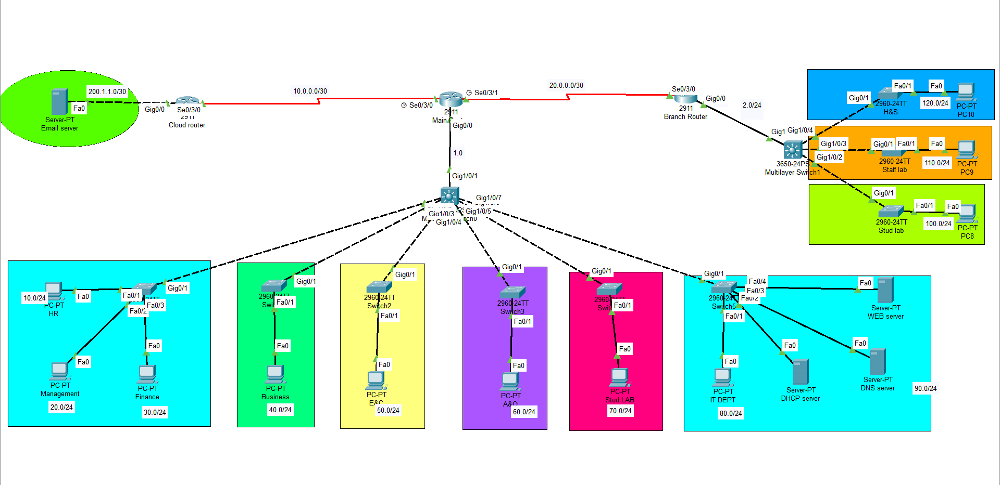

# Enterprise-multi-site-network-infrastructure
Enterprise Multi-Site Network Infrastructure using Cisco Packet Tracer with VLANs, Inter-VLAN Routing, DHCP, DNS, Web, Email Services and Branch Connectivity.

# Enterprise Multi-Site Network Infrastructure

## Topology

## Overview

This project simulates a multi-site enterprise network using Cisco Packet Tracer. The topology consists of a headquarters network, branch office connectivity, departmental VLANs, and centralized network services including DHCP, DNS, Web, and Email servers.

## Features

- Multi-Site Network Design
- VLAN Segmentation
- Inter-VLAN Routing
- DHCP Server
- DNS Server
- Web Server
- Email Server
- Branch Office Connectivity
- Multilayer Switching
- Department-Based Network Architecture

## Departments

- HR
- Management
- Finance
- Business
- E&C
- A&D
- Student Lab
- IT Department

## Services

- DHCP
- DNS
- Web
- Email

## Skills Demonstrated

- Routing and Switching
- VLAN Configuration
- Enterprise Network Design
- Server Deployment
- Network Troubleshooting
